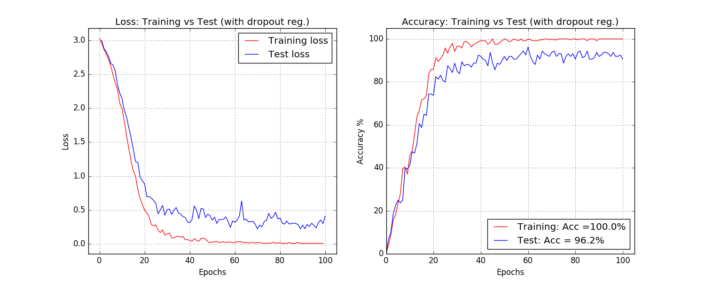

# Convolution neural network

This is a tensorflow implentation of deep layer convolution neural network on the [ORL faces](http://www.cl.cam.ac.uk/research/dtg/attarchive/facedatabase.html)

There are ten different images of each of 40 distinct subjects. For some subjects, the images were taken at different times, varying the lighting, facial expressions (open / closed eyes, smiling / not smiling) and facial details (glasses / no glasses). All the images were taken against a dark homogeneous background with the subjects in an upright, frontal position (with tolerance for some side movement).


#Runing the script

Unzip the dataset first 
```sh
$ python convnet.py
```
A successful run will should display a plot of the loss function and accuracy as shown below..




